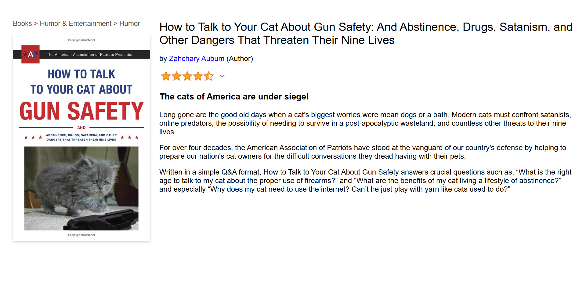

# Amazon Product Page Clone

An Amazon product page clone built with **HTML & CSS** as a learning project from the [Scrimba HTML & CSS Course](https://scrimba.com/learn-html-and-css-c0p).



## Project Overview

This is a static recreation of an Amazon product page, demonstrating core web design principles including semantic HTML structure and CSS layout techniques. The project showcases the use of **Flexbox** for flexible component arrangement.

## Live Demo

Check out the live version here: [https://shabasy-amazon-product-page.netlify.app/](https://shabasy-amazon-product-page.netlify.app/)

## Project Structure

```
Amazon-Product-Page/
├── index.html      # Main HTML structure
├── styles.css      # Styling and layout
└── images/         # Product images and assets
```

## Technologies Used

- **HTML5** - Semantic markup and structure
- **CSS3** - Styling, and Flexbox layouts

## What I Learned

This project helped me practice:
- Writing HTML
- CSS Flexbox for layout and alignment
- Building reusable component-based layouts

## Course Reference

This project is based on the **[Scrimba HTML & CSS Course](https://scrimba.com/learn-html-and-css-c0p)** - a comprehensive course that covers the fundamentals of web design and layout.

## About Me

I'm a web developer learning and building projects to strengthen my skills. Connect with me:
- **LinkedIn**: [linkedin.com/in/shabasy](https://linkedin.com/in/shabasy)

## License

This project is provided as-is for educational purposes.

---

Feel free to fork, clone, and use this as a reference for your own learning projects!
